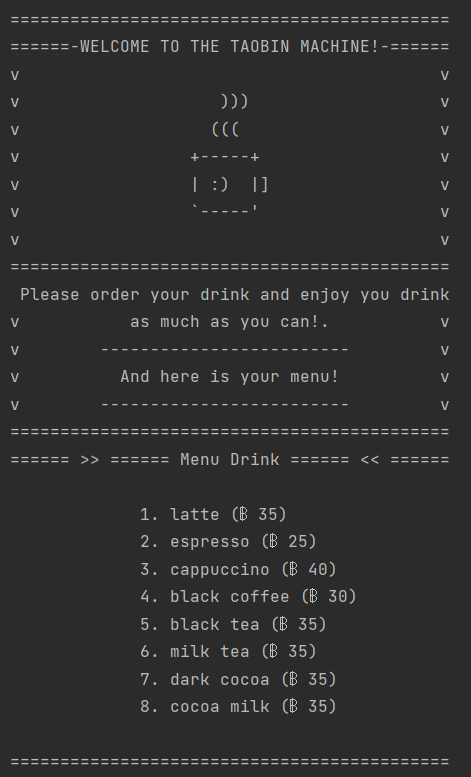
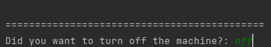
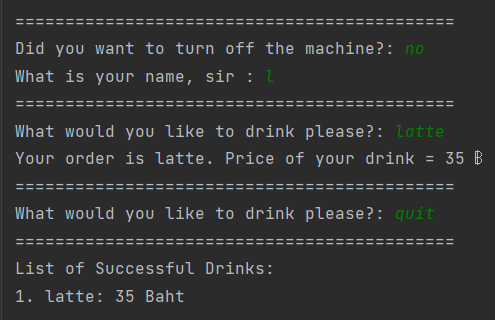

# Taobin Machine Simulation

Taobin machine simulation is a simple digital version of a taobin machine that simulates the option of purchasing one of eight different taobin machines.
available menu: latte, espresso, cappuccino, black coffee, dark cocoa, cocoa milk, black tea, and milk tea.

In the program, it can keep track of the taobin machine's resources and give a prompt accordingly if any of them are lacking.
In addition, you can shut the machine down for maintenance with the command "off."

The machine can also calculate the money that comes from the sale of drinks; it will be calculated in baht.
And it calculates the inserted bahts and gives back change if there is any.
## Program Overview and Features
This is a program for Taobin simulation. When you run the program, the menu guide page in the beverage machine will appear.

And after that, there will be a program asking if you want to turn off the machine; if so, just input the word "off," and the machine will shut down.

If you want to order a drink, you can input your name, then order the drink you want, and when you finish ordering 
the menu you want, when you enter "quit," the program will break. and finish the order. It will then report the menu and 
the price of the menu item you just ordered.

## Program's Requirement

- json: Used for Storing Customer's Data

- sys: Used for Check System OS

## Program Design
There are 5 classes in this Program.

- IngredientManagement : This class is used for managing the ingredients of the taobin machine.

- MoneyManagement : This class is used for managing the money system of the taobin machine. 

- MenuDrink : This class is used for managing the ingredients in menu drinks.

- TaobinMachine : This class is used for manages the taobin machine.

- Account : This class is used for managing customers' Data. It reads and writes customers' data in json file.

## Code Structure

- main_taobin_machine.py : Run Main Program.

- manage_ingredient.py : Contains Ingredient Management Class.

- manage_money.py : Contains Money Management Classes.

- menu_drink.py : Contains Menu Drink Classes.

- taobin_machine.py : Contains Taobin Machine Class.

- account_taobin.py : Coutains Account Class.

- accounts.json : Contains Customers' Data (Name and Order).